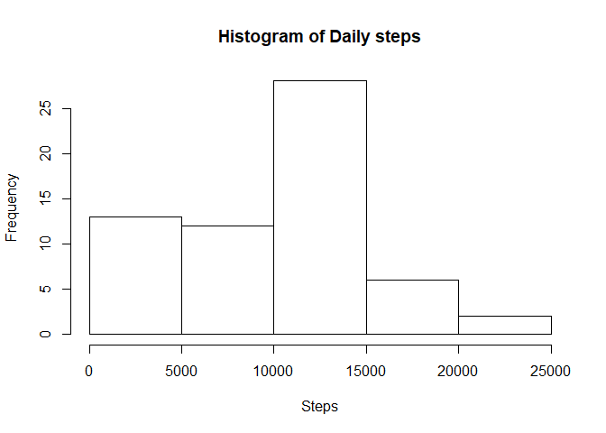
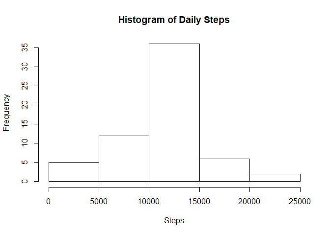
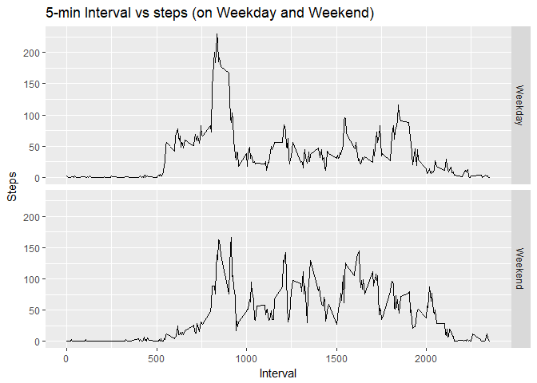

```r
fileloc<-"C:/projects/17-coursera-DS/5-reproducible/project1/data/activity.csv"
print(fileloc)
```

```
## [1] "C:/projects/17-coursera-DS/5-reproducible/project1/data/activity.csv"
```


```r
#getwd()
```

### Loading and preprocessing the data


```r
activity<-read.csv(fileloc)
```


### What is mean total number of steps taken per day?


```r
# calculate daily steps without intervals ignoring NAs
dailysteps<-aggregate(activity$steps, by = list(activity$date), sum, na.rm=TRUE, na.action = NULL)
# change column names
colnames(dailysteps)<-c("date", "steps")
head(dailysteps)
```

```
##         date steps
## 1 2012-10-01     0
## 2 2012-10-02   126
## 3 2012-10-03 11352
## 4 2012-10-04 12116
## 5 2012-10-05 13294
## 6 2012-10-06 15420
```

### What is the average daily activity pattern?

```r
# Make a histogram
hist(dailysteps$steps, main = "Histogram of Daily steps", xlab = "Steps")
```

<!-- -->

```r
# mean of daily steps
print(mean(dailysteps$steps))
```

```
## [1] 9354.23
```

```r
# median of daily steps
print(median(dailysteps$steps))
```

```
## [1] 10395
```
### Time series plot of the average number of steps taken

```r
# plot interval vs steps (averaged across all days)
avg_steps_by_interval<-aggregate(activity$steps, by = list(activity$interval), mean, na.rm=TRUE, na.action = NULL)
colnames(avg_steps_by_interval)<-c("interval", "steps")
plot(avg_steps_by_interval$interval, avg_steps_by_interval$steps, type = 'l', xlab="Interval", ylab="Average Steps")
```

<!-- -->


### The 5-minute interval that, on average, contains the maximum number of steps

```r
# which 5-min interval contains max no of steps
avg_steps_by_interval[avg_steps_by_interval$steps == max(avg_steps_by_interval$steps),]
```

```
##     interval    steps
## 104      835 206.1698
```


### Imputing missing values

```r
# check the no of missing values in all columns
sapply(activity, function(x) sum(is.na(x)))
```

```
##    steps     date interval 
##     2304        0        0
```

```r
# filling the missing value with mean for that 5-min interval
activity_new<-activity
activity_new$steps <- ifelse(is.na(activity_new$steps),avg_steps_by_interval$steps[match(activity_new$interval, avg_steps_by_interval$interval)], activity_new$steps )
sapply(activity_new, function(x) sum(is.na(x)))
```

```
##    steps     date interval 
##        0        0        0
```
### Histogram of the total number of steps taken each day after missing values are imputed

```r
# histogram of total no of steps taken each day (after imputing missing values)
dailysteps_new<-aggregate(activity_new$steps, by = list(activity_new$date), sum)
# change column names
colnames(dailysteps_new)<-c("date", "steps")
hist(dailysteps_new$steps, main = "Histogram of Daily Steps", xlab = "Steps")
```

<!-- -->


### New Mean and Media values after missing values are imputed

```r
# mean and median values (after imputing missing values)
mean(dailysteps_new$steps)
```

```
## [1] 10766.19
```

```r
median(dailysteps_new$steps)
```

```
## [1] 10766.19
```

### Are there differences in activity patterns between weekdays and weekends?

```r
# Are there differences in activity patterns between weekdays and weekends?
activity_new$weekday<-as.POSIXlt(activity_new$date)$wday
activity_new$weekday<-as.factor(activity_new$weekday)

# create a new factor variable for weekend
activity_new$weekend<-ifelse(activity_new$weekday==0 | activity_new$weekday==6, "Weekend", "Weekday")
activity_new$weekend<-as.factor(activity_new$weekend)

# Make a panel plot containing a time series plot of the 5-minute interval (x-axis) and
# the average number of steps taken, averaged across all weekday days or weekend days (y-axis).
avg_steps_by_interval_weekend<-aggregate(activity_new$steps, by = list(activity_new$interval, activity_new$weekend), mean)
colnames(avg_steps_by_interval_weekend)<-c("interval", "weekend", "steps")
library(ggplot2)
qplot(avg_steps_by_interval_weekend$interval, avg_steps_by_interval_weekend$steps, data = avg_steps_by_interval_weekend,
      facets = avg_steps_by_interval_weekend$weekend~., geom = "line",
      xlab="Interval", ylab = "Steps", main = "5-min Interval vs steps (on Weekday and Weekend)")
```

<!-- -->

